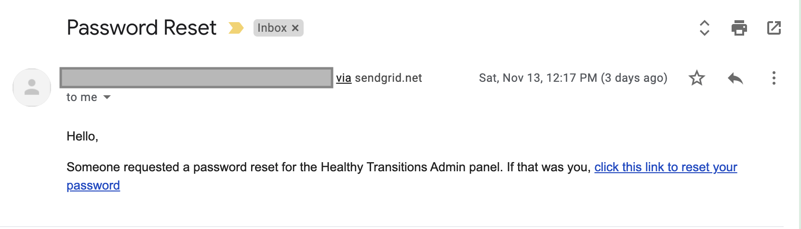
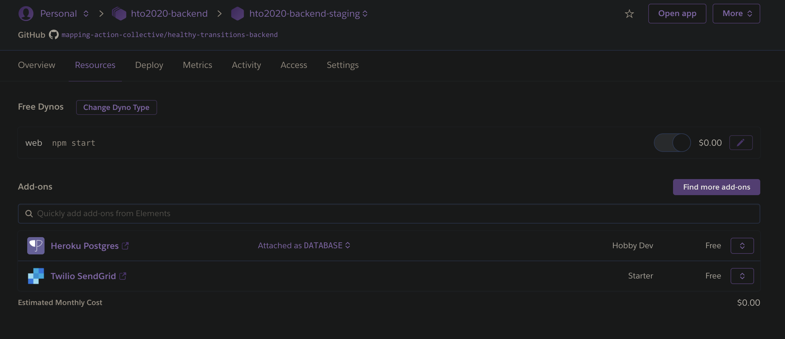

## HT Backend: Sending Email

**Note: For security, the email address stored in process.env.OWNER_EMAIL will be referred to as "Owner Email."**

**All accounts associated with the HT Backend are created under the Owner Email.**

### Overview

- This app uses the SendGrid Heroku Add-on to authorize sending email. 

- It also uses the Nodemailer library to format emails. Nodemailer is straightforward, well documented, and integrates well with SendGrid. Nodemailer and SendGrid are often used together. [Here's an example on how to do so.](https://docs.sendgrid.com/for-developers/sending-email/integrating-with-the-smtp-api)

- From a user perspective, our emails "come from" Owner Email, via SendGrid. Here's what the user sees when they request a password reset: 



- We're not using any Google APIs to make this happen - SendGrid is powering this all behind the scenes.
 
- Nodemailer gives us the option to specfiy sender email address each time we compose an email "transporter" object. Simply pass in the string you want, and it will become the "from" email that users see. In our case, we pass in the Owner Email. SendGrid does the rest.

### SendGrid Setup
There are two separate steps I took to enable our app to send email via SendGrid: 
1. Register for a free API key on SendGrid.com, and send up a "Sender Identity" to send emails from.
2. Install the free SendGrid Heroku add-on.

Both are done, tested, and ready to go. I'll talk about each step in detail.

#### Step 1: Get an API key from SendGrid.com
 
1. I created an account at SendGrid.comd using Owner Email.

2. Create a "Single Sender Identity." This is a single email address you'll be asked to prove that you own, that you can send the emails "from." Our single sender identity is Owner Email. 

      - In the future, we should verify a domain to send from, instead. Since we don't have a domain, I just did single sender verification for the time being. 
      - The API key is tied to the sender identity. If we switch to domain verification in the future, we need to obtain a new API key, then update it in both local and Heroku env vars as SENDGRID_API_KEY. 
      - [More information on the differences between Single Sender Verification, and Domain Authentication here.](https://docs.sendgrid.com/for-developers/sending-email/sender-identity)

3. I created for a free API key that doesn't expire. We only ever need to get the key once, and it's good for the lifetime of the app. 

4. I saved the API key to all env vars - both local and on Heroku - as SENDGRID_API_KEY. It's been saved to both the staging and prod Heroku instances.

Heroku handles the rest of the integration via the SendGrid add-on from there!

#### Step 2: Install the Heroku SendGrid Add-on
1. I went to the "Resources" tab on the app dashboard, and installed the "Twilio SendGrid" add-on:



[This link](https://dashboard.heroku.com/apps/hto2020-backend-staging/resources) will take you the dashboard for hto2020-backend-staging.

2. I added the SendGrid add-on to both backend instances. 

    Note: We're on the free SendGrid starter plan, and it will remain free indefinitely as long as we don't send more than 12,000 emails per month. 

3. The SendGrid add-on is basically magic; you just add it, and it works. You still have to configure a few things in Nodemailer, but other than that, at this point, you're good to go.

    **Note:** When you add the SendGrid add-on, it adds two variables to the Heroku env vars - SENDGRID_USERNAME, AND SENDGRID_PASSWORD. **Don't change, rename, or delete these, or the SendGrid integration will break.** This is how SendGrid authorizes our app to send email via Heroku.
  
   **Also, don't reference these in the code.** Their names are confusing, as Nodemailer will ask us for "user" and "pass" (explained below.) However, these specific env vars are used by Heroku behind the scenes **only. Don't try to use them in Nodemailer config, or Nodemailer won't work.**

#### Installation Summary
To review, we:
- Got an API key from SendGrid.com
- Added it to the Heroku env vars 
- Installed the Twilio SendGrid Heroku add-on. 

Now we're all set to start sending email! The next step is configuring Nodemailer to actually send the emails.

### How to send email from the HT Backend

Now that we have SendGrid set up and working, sending email is straightforward. I copied my code straight from the Nodemailer docs, and it works. 

To send an email from a route, you can do exactly this:

````
const { sendEmail } = ../utils/sendEmail

  const options = {
    subject: "Your subject line",
    html: "Html for the email body goes here",
    to: "example@example.com",
    from: process.env.OWNER_EMAIL // this is the "from" email the user will see  
  }

  sendEmail(options)
````
It's that easy! You can see more Nodemailer config options [here](https://nodemailer.com/message/). The first example given is the one I used.

#### Local Documentation
- See [routes/email.js](https://github.com/mapping-action-collective/healthy-transitions-backend/blob/documentation/routes/email.js) for a complete example of how to send email from a route. 
- See [utils/sendEmail.js](https://github.com/mapping-action-collective/healthy-transitions-backend/blob/documentation/utils/sendEmail.js) to see our Nodemailer setup, and how the "transporter" object is created.

**Reference Links:** 
- [Heroku SendGrid Overview](https://elements.heroku.com/addons/sendgrid)
- [Heroku SendGrid Documentation](https://devcenter.heroku.com/articles/sendgrid)
- [SendGrid.com: Single Sender Verification vs Domain Authentication](https://docs.sendgrid.com/for-developers/sending-email/sender-identity)
- [Nodemailer SendGrid Integration](https://docs.sendgrid.com/for-developers/sending-email/integrating-with-the-smtp-api)